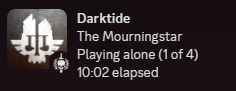

# Darktide Discord Rich Presence

Uses the Stingray Plugin API to integrate the Discord Game SDK into Darktide.

Credit to [thewhitegoatcb](https://github.com/thewhitegoatcb/rawray) for reverse engineering the Vermintide 2 Plugin API.

<p align="center">
	
</p>

## Installation

Place `darktide_discord_pluginw64.dll` in the `[game install]/binaries/plugins/` directory.

## Building

```
make
```

## API

The plugin exposes a Lua API for mods to use.

```lua
-- The version of the Darktide Discord plugin binary
DarktideDiscord.VERSION: number

-- Set the player's current party status
DarktideDiscord.set_state(state: string)

-- Set what the player is currently doing
DarktideDiscord.set_details(details: string)

-- Set the players current career archetype and details
DarktideDiscord.set_class(class: string, details: string)

-- Set the number of players in the current party
DarktideDiscord.set_party_size(size: number)

-- Reset the gameplay timer to 0
DarktideDiscord.set_start_time()

-- Call this in the game looop
DarktideDiscord.update();
```
